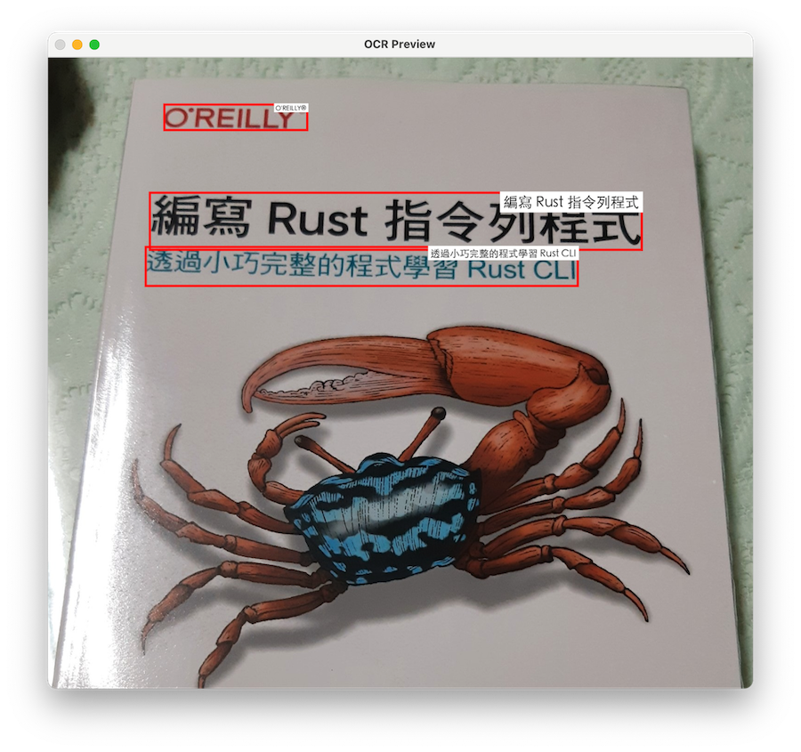

# OCR Server

Apple의 Vision Framework를 사용하여 iPhone을 강력한 로컬 OCR 서버로 변환합니다.
클라우드 의존성 없음, 무제한 사용, 완전한 개인정보 보호.

[App Store에서 다운로드](https://apps.apple.com/us/app/ocr-server/id6749533041)

[English](README.md) | [日本語](README.ja.md) | [繁體中文](README.zh-TW.md) | [简体中文](README.zh-CN.md) | **한국어** | [Français](README.fr.md)


## 사용 방법

1. 앱을 실행하면 서버가 자동으로 시작됩니다
2. 같은 네트워크의 모든 기기에서 표시된 IP 주소에 접근
3. 이미지를 업로드하여 텍스트 인식 결과 얻기
4. API를 통해 서비스를 애플리케이션에 통합
5. 앱이 중단 없이 지속적으로 실행되도록 iOS [사용법 유도](https://support.apple.com/ko-kr/111795) 모드를 활성화하고 화면을 켜둡니다

- **OCR 테스트: 컴퓨터에서 웹 브라우저를 열고 앱에 표시된 IP 주소로 이동하여 OCR 테스트를 수행합니다.**


- **API 예제 - `upload` API를 통한 이미지 업로드:**

  ```
  curl -H "Accept: application/json" \
    -X POST http://<당신의IP>:8000/upload \
    -F "file=@01.png"
  ```

- **Python 업로드 예제:**

  ```python
  import requests

  url = "http://10.0.1.11:8000/upload"  # 당신의 IP 주소로 교체하세요
  file_path = "01.png"

  with open(file_path, "rb") as f:
      files = {"file": f}
      headers = {"Accept": "application/json"}
      response = requests.post(url, files=files, headers=headers)

  print("status code:", response.status_code)
  print("response:", response.text)
  ```

- **JSON 응답은 다음과 같습니다：**

  ```json
  {
    "success": true,
    "message": "File uploaded successfully",
    "ocr_result": "Hello\nWorld",
    "image_height": 648,
    "image_width": 1247,
    "ocr_boxes": [
      {
        "text": "Hello",
        "x": 429.6554479416482,
        "y": 268.0000001076923,
        "w": 201.83814102564105,
        "h": 72,
        "rect": {
          "topLeft_x": 429.6554479416482,
          "topLeft_y": 268.0000001076923,
          "topRight_x": 631.4935889672893,
          "topRight_y": 268.0000001076923,
          "bottomRight_x": 631.4935889672893,
          "bottomRight_y": 340.0000001076923,
          "bottomLeft_x": 429.6554479416482,
          "bottomLeft_y": 340.0000001076923
        }
      },
      {
        "text": "World",
        "x": 421.6618595738782,
        "y": 417.99999971428576,
        "w": 251.79807692307696,
        "h": 80,
        "rect": {
          "topLeft_x": 421.6618595738782,
          "topLeft_y": 417.99999971428576,
          "topRight_x": 673.4599364969552,
          "topRight_y": 417.99999971428576,
          "bottomRight_x": 673.4599364969552,
          "bottomRight_y": 497.99999971428576,
          "bottomLeft_x": 421.6618595738782,
          "bottomLeft_y": 497.99999971428576
        }
      }
    ]
  }
  ```

  `image_width`와 `image_height`는 이미지의 너비와 높이를 나타냅니다（픽셀 단위）,
  `x`와 `y`는 텍스트 바운딩 박스의 좌상단 원점을 나타냅니다（픽셀 단위）,
  `w`와 `h`는 텍스트 바운딩 박스의 너비와 높이를 나타냅니다（픽셀 단위）。

- **Python 예제 – `ocr_boxes` 정보를 사용하여 텍스트 바운딩 박스 그리기：**

  ```python
  #
  # pip3 install requests pillow opencv-python numpy
  #

  import os
  import sys
  import requests
  from PIL import Image, ImageDraw, ImageFont, ImageOps
  import numpy as np
  import cv2

  url = "http://10.0.1.11:8000/upload"  # Replace with your IP address
  file_path = "01.png"

  # ===== Select font (supports Chinese and English), font size auto-scales with box height =====
  def pick_font(box_h_px: float):
      font_candidates = [
          # macOS
          "/System/Library/Fonts/PingFang.ttc",
          "/System/Library/Fonts/STHeiti Light.ttc",
          # Windows
          r"C:\Windows\Fonts\msyh.ttc",
          r"C:\Windows\Fonts\msjh.ttc",
          r"C:\Windows\Fonts\arialuni.ttf",
          # Noto
          "/usr/share/fonts/opentype/noto/NotoSansCJK-Regular.ttc",
          "/usr/share/fonts/truetype/noto/NotoSansCJK-Regular.ttc",
      ]
      size = max(10, int(box_h_px * 0.25))  # Small font size = 25% of box height (minimum 10pt)
      for path in font_candidates:
          if os.path.exists(path):
              try:
                  return ImageFont.truetype(path, size=size)
              except Exception:
                  pass
      return ImageFont.load_default()

  # ===== Draw box and small text =====
  def draw_boxes(img_pil: Image.Image, boxes, line_thickness: int = 5) -> Image.Image:
      draw = ImageDraw.Draw(img_pil)
      for b in boxes:
          try:
              x = float(b["x"]); y = float(b["y"])
              w = float(b["w"]); h = float(b["h"])
              text = str(b.get("text", ""))
          except Exception:
              continue

          # Red bounding box
          x2, y2 = x + w, y + h
          draw.rectangle([x, y, x2, y2], outline=(255, 0, 0), width=line_thickness)

          # Top-right label
          font = pick_font(h)
          # Text size
          # textbbox returns (l, t, r, b)
          l, t, r, b = draw.textbbox((0, 0), text, font=font)
          tw, th = (r - l), (b - t)
          pad = max(2, int(h * 0.06))

          # Align label to top-right, not exceeding box or image edge
          tx = int(max(0, min(x2 - tw - pad, img_pil.width - tw - pad)))
          ty = int(max(0, min(y + pad, img_pil.height - th - pad)))

          # White background
          draw.rectangle([tx - pad, ty - pad, tx + tw + pad, ty + th + pad], fill=(255, 255, 255))
          draw.text((tx, ty), text, font=font, fill=(20, 20, 20))
      return img_pil

  def main():
      if not os.path.exists(file_path):
          print(f"[ERROR] Image not found: {file_path}", file=sys.stderr)
          sys.exit(1)

      # 1) Upload
      with open(file_path, "rb") as f:
          files = {"file": f}
          headers = {"Accept": "application/json"}
          try:
              response = requests.post(url, files=files, headers=headers, timeout=60)
          except requests.RequestException as e:
              print(f"[ERROR] Request failed: {e}", file=sys.stderr)
              sys.exit(2)

      print("status code:", response.status_code)

      # 2) Check HTTP and JSON
      if response.status_code != 200:
          print("response:", response.text[:500])
          sys.exit(3)

      try:
          data = response.json()
      except ValueError:
          print("[ERROR] Not JSON response")
          print("response:", response.text[:500])
          sys.exit(4)

      if not data.get("success", False):
          print("[ERROR] Server returned failure:", data)
          sys.exit(5)

      print("response ok")

      # 3) Load original image (using PIL)
      img_pil = Image.open(file_path)
      img_pil = ImageOps.exif_transpose(img_pil).convert("RGB")

      # If server returns different dimensions (should usually match), use server dimensions
      W = int(data.get("image_width", img_pil.width))
      H = int(data.get("image_height", img_pil.height))
      if (W, H) != (img_pil.width, img_pil.height):
          img_pil = img_pil.resize((W, H), Image.BICUBIC)

      boxes = data.get("ocr_boxes", [])
      img_pil = draw_boxes(img_pil, boxes)

      # 4) Display
      img_cv = cv2.cvtColor(np.array(img_pil), cv2.COLOR_RGB2BGR)
      cv2.imshow("OCR Preview", img_cv)
      print("Press any key on the image window to exit...")
      cv2.waitKey(0)
      cv2.destroyAllWindows()

  if __name__ == "__main__":
      main()
  ```

  샘플 출력：

  


## 기능

- Apple Vision Framework 기반 고정밀 OCR
- 자동 감지를 통한 다국어 지원
- 웹 인터페이스를 통한 업로드 및 수초 내 OCR 결과 제공
- 앱 통합을 위한 JSON API
- 100% 로컬 처리, 클라우드 없음, 완전한 개인정보 보호


## 사용 사례

- 클라우드 서비스 없는 로컬 OCR
- 같은 네트워크 내 기기 간 OCR 서비스 공유
- 여러 iPhone을 사용한 OCR 처리 클러스터 구축