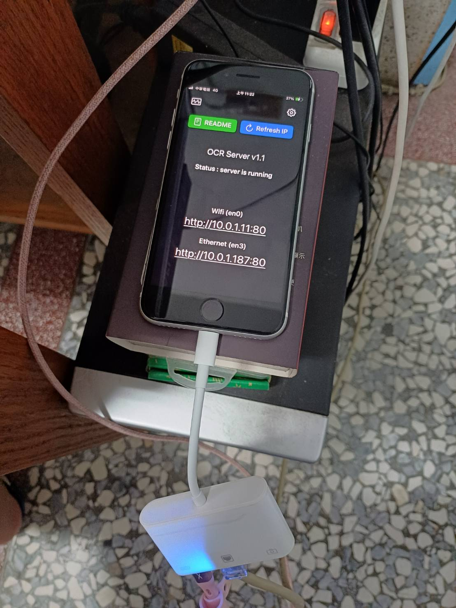
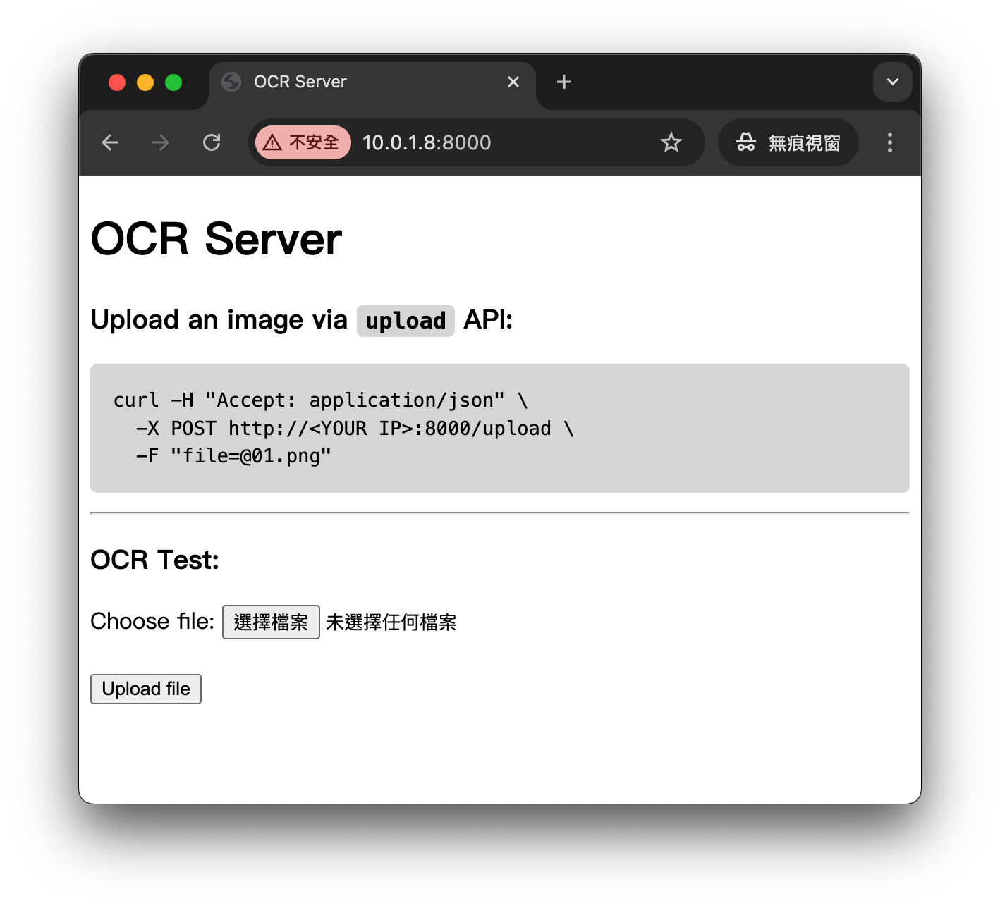

# OCR Server

将您的 iPhone 变成强大的本地 OCR 服务器，采用 Apple 的 Vision Framework 技术。
无需云端依赖，无限制使用，完全隐私保护。

[从 App Store 下载](https://apps.apple.com/us/app/ocr-server/id6749533041)

[English](README.md) | [日本語](README.ja.md) | [繁體中文](README.zh-TW.md) | **简体中文**



## 使用方法

1. 启动应用程序，服务器将自动启动
2. 从同一网络上的任何设备访问显示的 IP 地址
3. 上传图像即可获得文字识别结果
4. 通过 API 将服务集成到您的应用程序中

- **OCR 测试：在您的计算机上打开网页浏览器，浏览应用程序显示的 IP 地址来执行 OCR 测试。**



- **API 示例：通过 `upload` API 上传图像：**

  ```
  curl -H "Accept: application/json" \
    -X POST http://<您的IP>:8000/upload \
    -F "file=@01.png"
  ```

- **Python 上传示例：**

  ```python
  import requests

  url = "http://10.0.1.11:8000/upload"  # 替换为您的 IP 地址
  file_path = "01.png"

  with open(file_path, "rb") as f:
      files = {"file": f}
      headers = {"Accept": "application/json"}
      response = requests.post(url, files=files, headers=headers)

  print("status code:", response.status_code)
  print("response:", response.text)
  ```


## 功能特色

- 采用 Apple Vision Framework 的高精度 OCR
- 支持多语言自动检测
- 通过网页界面上传并在数秒内获得 OCR 结果
- JSON API 便于集成到应用程序中
- 100% 本地处理，无云端依赖，完全隐私保护


## 使用场景

- 无需云端服务的本地 OCR
- 在同一网络内的设备间共享 OCR 服务
- 使用多台 iPhone 构建 OCR 处理集群
