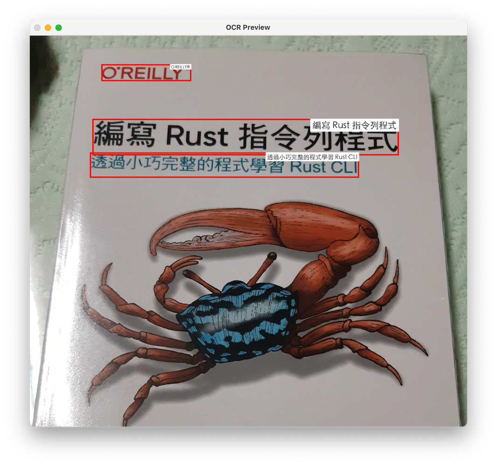

# OCR Server

将您的 iPhone 变成强大的本地 OCR 服务器，采用 Apple 的 Vision Framework 技术。
无需云端依赖，无限制使用，完全隐私保护。

[从 App Store 下载](https://apps.apple.com/us/app/ocr-server/id6749533041)

[English](README.md) | [日本語](README.ja.md) | [繁體中文](README.zh-TW.md) | **简体中文** | [한국어](README.ko.md) | [Français](README.fr.md)


## 使用方法

1. 启动应用程序，服务器将自动启动
2. 从同一网络上的任何设备访问显示的 IP 地址
3. 上传图像即可获得文字识别结果
4. 通过 API 将服务集成到您的应用程序中
5. 为确保应用程序持续运行不中断，请启用 iOS [引导式访问](https://support.apple.com/zh-cn/111795)模式并保持屏幕开启

- **OCR 测试：在您的计算机上打开网页浏览器，浏览应用程序显示的 IP 地址来执行 OCR 测试。**


- **API 示例 - 通过 `upload` API 上传图像：**

  ```
  curl -H "Accept: application/json" \
    -X POST http://<您的IP>:8000/upload \
    -F "file=@01.png"
  ```

- **Python 上传示例：**

  ```python
  import requests

  url = "http://10.0.1.11:8000/upload"  # 替换为您的 IP 地址
  file_path = "01.png"

  with open(file_path, "rb") as f:
      files = {"file": f}
      headers = {"Accept": "application/json"}
      response = requests.post(url, files=files, headers=headers)

  print("status code:", response.status_code)
  print("response:", response.text)
  ```

- **JSON 响应格式如下：**

  ```json
  {
    "success": true,
    "message": "File uploaded successfully",
    "ocr_result": "Hello\nWorld",
    "image_width": 1247,
    "image_height": 648,
    "ocr_boxes": [
      {
        "text": "Hello",
        "x": 434.7201472051599,
        "y": 269.3123034733379,
        "w": 216.30970547749456,
        "h": 69.04344177246088
      },
      {
        "text": "World",
        "x": 429.5100030105896,
        "y": 420.4043957924413,
        "w": 242.85499225518635,
        "h": 73.382080078125
      }
    ]
  }
  ```

  `image_width` 和 `image_height` 代表图像的宽度和高度（以像素为单位），
  `x` 和 `y` 代表文字边界框的左上角原点（以像素为单位），
  `w` 和 `h` 代表文字边界框的宽度和高度（以像素为单位）。

- **Python 示例 – 使用 `ocr_boxes` 信息绘制文字边界框：**

  ```python
  #
  # pip3 install requests pillow opencv-python
  #

  import os
  import sys
  import requests
  from PIL import Image, ImageDraw, ImageFont
  import numpy as np
  import cv2

  url = "http://10.0.1.11:8000/upload"  # Replace with your IP address
  file_path = "01.png"

  # ===== Select font (supports Chinese and English), font size auto-scales with box height =====
  def pick_font(box_h_px: float):
      font_candidates = [
          # macOS
          "/System/Library/Fonts/PingFang.ttc",
          "/System/Library/Fonts/STHeiti Light.ttc",
          # Windows
          r"C:\Windows\Fonts\msyh.ttc",
          r"C:\Windows\Fonts\msjh.ttc",
          r"C:\Windows\Fonts\arialuni.ttf",
          # Noto
          "/usr/share/fonts/opentype/noto/NotoSansCJK-Regular.ttc",
          "/usr/share/fonts/truetype/noto/NotoSansCJK-Regular.ttc",
      ]
      size = max(10, int(box_h_px * 0.25))  # Small font size = 25% of box height (minimum 10pt)
      for path in font_candidates:
          if os.path.exists(path):
              try:
                  return ImageFont.truetype(path, size=size)
              except Exception:
                  pass
      return ImageFont.load_default()

  # ===== Draw box and small text =====
  def draw_boxes(img_pil: Image.Image, boxes, line_thickness: int = 5) -> Image.Image:
      draw = ImageDraw.Draw(img_pil)
      for b in boxes:
          try:
              x = float(b["x"]); y = float(b["y"])
              w = float(b["w"]); h = float(b["h"])
              text = str(b.get("text", ""))
          except Exception:
              continue

          # Red bounding box
          x2, y2 = x + w, y + h
          draw.rectangle([x, y, x2, y2], outline=(255, 0, 0), width=line_thickness)

          # Top-right label
          font = pick_font(h)
          # Text size
          # textbbox returns (l, t, r, b)
          l, t, r, b = draw.textbbox((0, 0), text, font=font)
          tw, th = (r - l), (b - t)
          pad = max(2, int(h * 0.06))

          # Align label to top-right, not exceeding box or image edge
          tx = int(max(0, min(x2 - tw - pad, img_pil.width - tw - pad)))
          ty = int(max(0, min(y + pad, img_pil.height - th - pad)))

          # White background
          draw.rectangle([tx - pad, ty - pad, tx + tw + pad, ty + th + pad], fill=(255, 255, 255))
          draw.text((tx, ty), text, font=font, fill=(20, 20, 20))
      return img_pil

  def main():
      if not os.path.exists(file_path):
          print(f"[ERROR] Image not found: {file_path}", file=sys.stderr)
          sys.exit(1)

      # 1) Upload
      with open(file_path, "rb") as f:
          files = {"file": f}
          headers = {"Accept": "application/json"}
          try:
              response = requests.post(url, files=files, headers=headers, timeout=60)
          except requests.RequestException as e:
              print(f"[ERROR] Request failed: {e}", file=sys.stderr)
              sys.exit(2)

      print("status code:", response.status_code)

      # 2) Check HTTP and JSON
      if response.status_code != 200:
          print("response:", response.text[:500])
          sys.exit(3)

      try:
          data = response.json()
      except ValueError:
          print("[ERROR] Not JSON response")
          print("response:", response.text[:500])
          sys.exit(4)

      if not data.get("success", False):
          print("[ERROR] Server returned failure:", data)
          sys.exit(5)

      print("response ok")

      # 3) Load original image (using PIL)
      img_pil = Image.open(file_path).convert("RGB")

      # If server returns different dimensions (should usually match), use server dimensions
      W = int(data.get("image_width", img_pil.width))
      H = int(data.get("image_height", img_pil.height))
      if (W, H) != (img_pil.width, img_pil.height):
          img_pil = img_pil.resize((W, H), Image.BICUBIC)

      boxes = data.get("ocr_boxes", [])
      img_pil = draw_boxes(img_pil, boxes)

      # 4) Display
      img_cv = cv2.cvtColor(np.array(img_pil), cv2.COLOR_RGB2BGR)
      cv2.imshow("OCR Preview", img_cv)
      print("Press any key on the image window to exit...")
      cv2.waitKey(0)
      cv2.destroyAllWindows()

  if __name__ == "__main__":
      main()
  ```

  示例输出：

  


## 功能特色

- 采用 Apple Vision Framework 的高精度 OCR
- 支持多语言自动检测
- 通过网页界面上传并在数秒内获得 OCR 结果
- JSON API 便于集成到应用程序中
- 100% 本地处理，无云端依赖，完全隐私保护


## 使用场景

- 无需云端服务的本地 OCR
- 在同一网络内的设备间共享 OCR 服务
- 使用多台 iPhone 构建 OCR 处理集群
